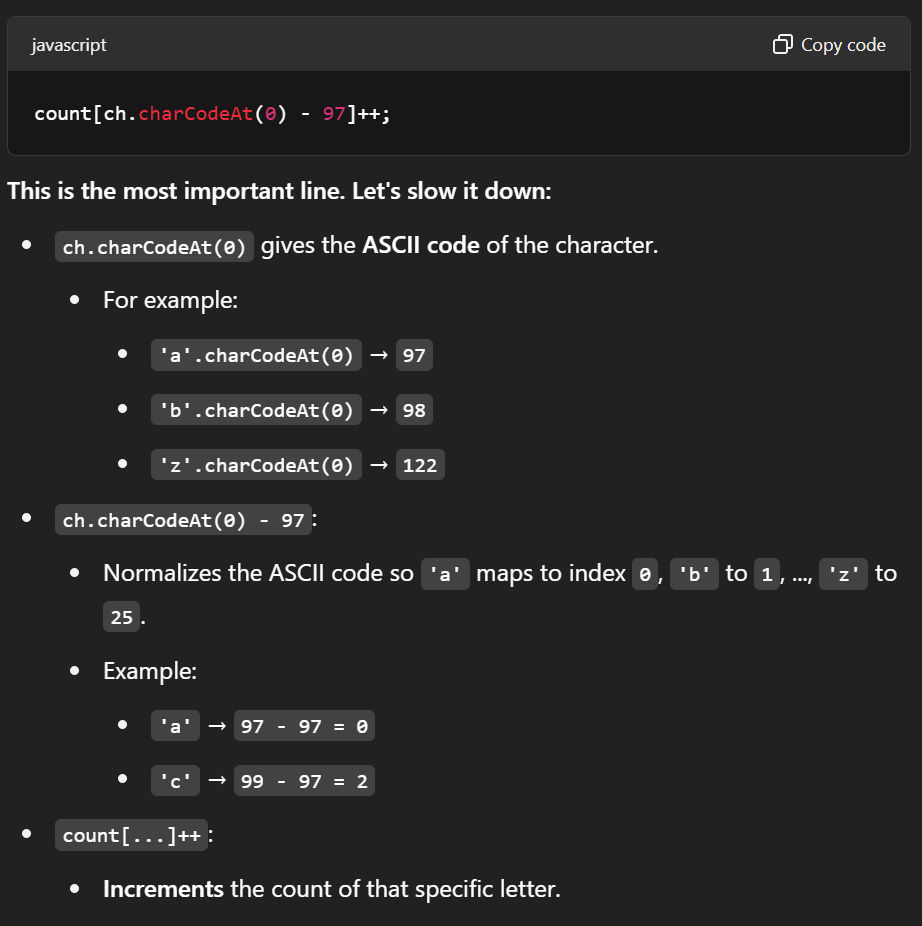

https://leetcode.com/problems/group-anagrams/

```js
var groupAnagrams = function(strs) {
    const map = new Map();

    for (let str of strs) {
        const count = new Array(26).fill(0);
        
        for (let ch of str) {
            count[ch.charCodeAt(0) - 97]++;
        }

        const key = count.join('#'); // Serialize to a string key

        if (!map.has(key)) {
            map.set(key, []);
        }
        map.get(key).push(str);
    }

    return Array.from(map.values());
};
```


```js
var groupAnagrams = function(strs) {
    const map = new Map();

    for (let str of strs) {
        const count = new Array(26).fill(0);

        for (let ch of str) {
            count[ch.charCodeAt(0) - 97]++;
        }

        const key = JSON.stringify(count); // Serialize array to a string

        if (!map.has(key)) {
            map.set(key, []);
        }
        map.get(key).push(str);
    }

    return Array.from(map.values());
};

```

